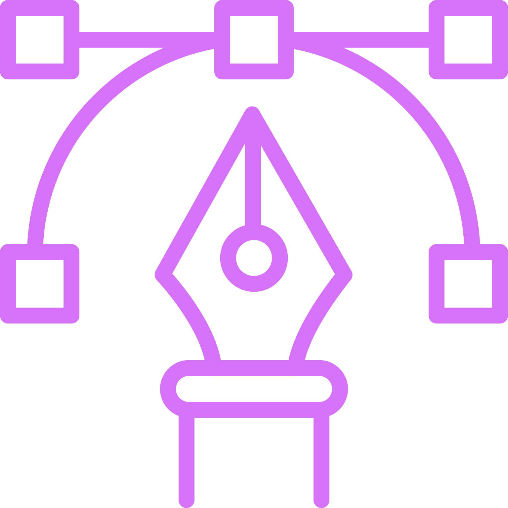

<h1>
    
    Isabelle V. Caliani
</h1>

**`Digital Designer`**

With a Digital Design degree, I thrive on bringing ideas into reality through captivating visuals and good experience for the user's journey.

<h3>
    💻 Techonologies & Tools
</h3>

